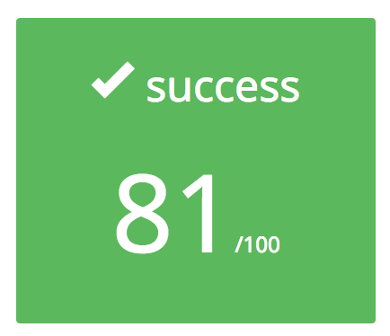
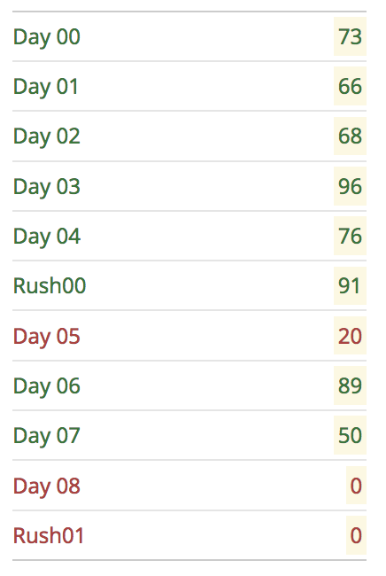

# École 42

## Piscine C++

The C++ Piscine is the next step in the 42 Curriculum. During these two weeks
you will discover more about OOP by learning specifics of the C++ language.
Successfully completing this challenge will unlock the object-oriented
projects and prepare you for future objectives and jobs.

*Disclaimer: I've fixed a lot of the exercises, and made new solutions
to previous ones that I didn't completed during my piscine.
These scores don't show the final mark of this repository.*

### TODO || TOFIX

* Day00
	- ex02
* Day01
	- ex08
	- ex09
* Day02
	- ex04
* Day04
	- ex04
* Day07
	- ex02
* Day08
	- ex01
	- ex02
	- ex03
	- ex04
* Rush01
