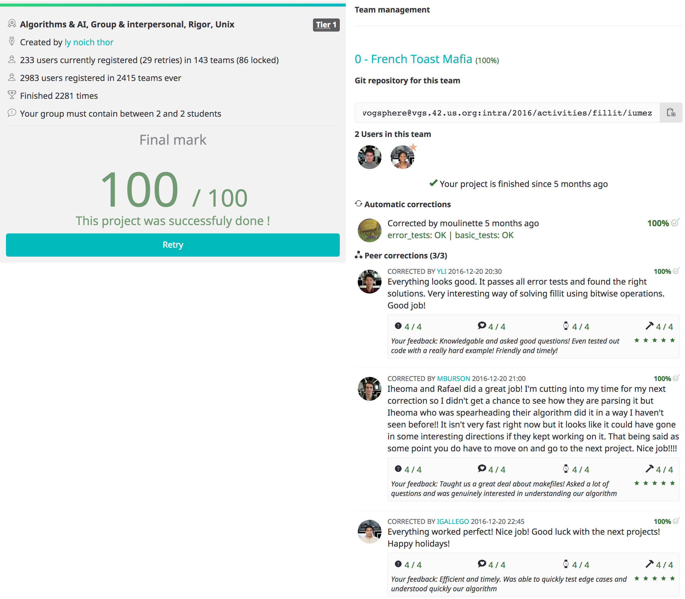

# Fillit

## Description

Fillit is a project allowing you to discover and / or familiarize yourself with
a recurring problem in programming: the search for an optimal solution among a
very large number of possibilities, within a reasonable time. In the case of
this project, it will be necessary to arrange the Tetriminos among themselves
and to determine the smallest possible square that can accommodate them.

## Objectives

* Basic
* Input / Output Algorithmic

## Skills

* Algorithms & AI
* Group & interpersonal
* Rigor
* Unix

## Licensing
> Project Design Created by:
>> Mother of Dragon (and Moulinette) Ly, Real Platinum God Noich, The Mighty Thor
