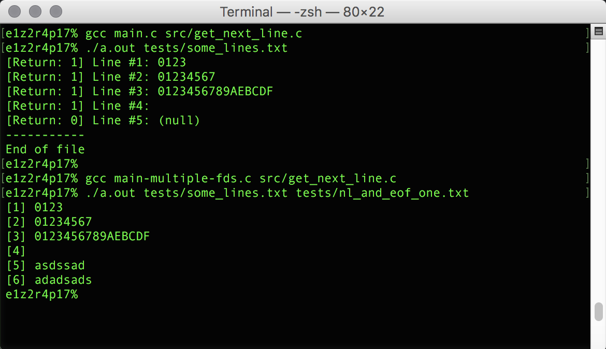

# École 42

## Get_Next_Line

This projects is about creating a function that, allows to read a line ending
with a newline character ('\\n') from a file descriptor, without knowing its
size beforehand. One of the goal of this project is to learn a highly
interesting new concept in C programming: static variables, and to gain a deeper
understanding of allocations, whether they happen on the stack memory or in the
heap memory, the manipulation and the life cycle of a buffer, the unexpected
complexity implied in the use of one or many static variables.

## Getting Started

### Compiling

Run the following commands:

* To compile
	- `make`
* To remove objects:
	- `make clean`
* To remove objects and binary file (program):
	- `make fclean`
* To re-compile:
	- `make re`

### Executing

To test the function, compile with main.c.

`gcc main.c src/get_next_line.c`

`./a.out tests/some_lines.txt`

If wanted to test with multiple file descriptors, compile with
main-multiple-fds.c

`gcc main-multiple-fds.c src/get_next_line.c`

`./a.out tests/some_lines.txt tests/nl_and_eof_one.txt`

## Screenshots

**Testing the library:**

