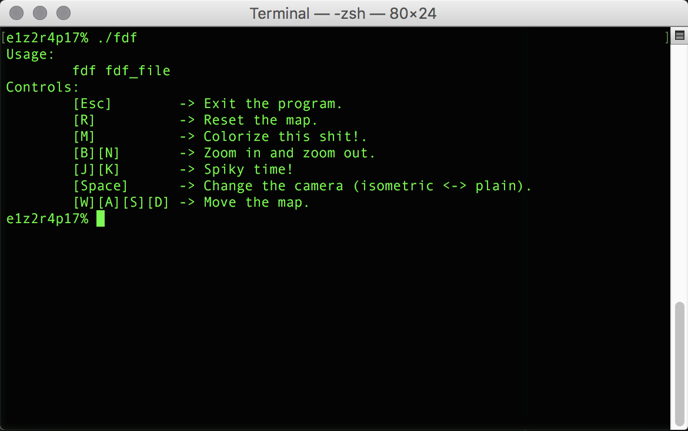
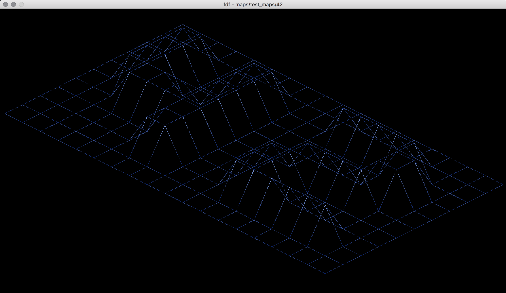
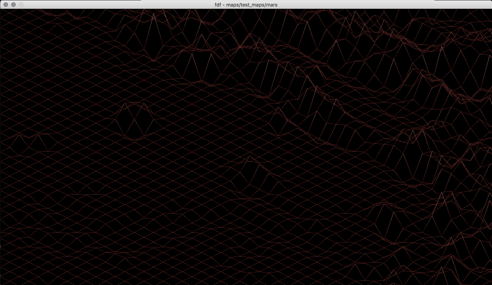
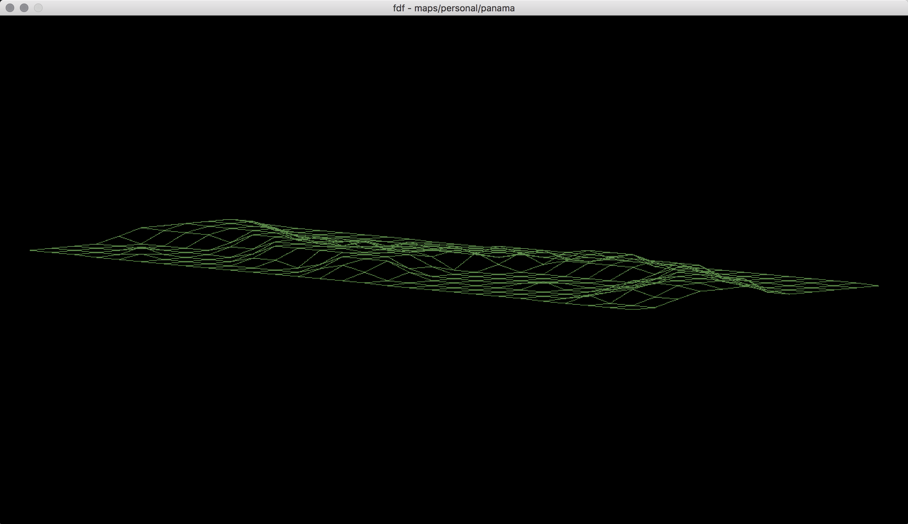

# 42 US

## FDF

This projects seeks to show the basics of graphic programming, and in particular
how to place points in space, how to join them with segments and most
importantly how to observe the scene from a particular viewpoint.
It uses the library miniLibX, developed internally and includes the minimum
necessary to open a window, light a pixel and deal with events linked to
this window: keyboard, mouse and “expose”. Pretty much, this project introduces
the events programming.

## Getting Started

### Compiling

Run the following commands:

* To compile
	- `make`
* To remove objects:
	- `make clean`
* To remove objects and binary file (program):
	- `make fclean`
* To re-compile:
	- `make re`

### Executing

To execute the program:

`./fdf <fdf-file>`

#### Try it!

Try running the following:

`./fdf maps/test_maps/42.fdf`

`./fdf maps/test_maps/mars.fdf`

`./fdf maps/personal/panama.fdf`

## Screenshots

**Usage message and controls:**

**Program running:**

