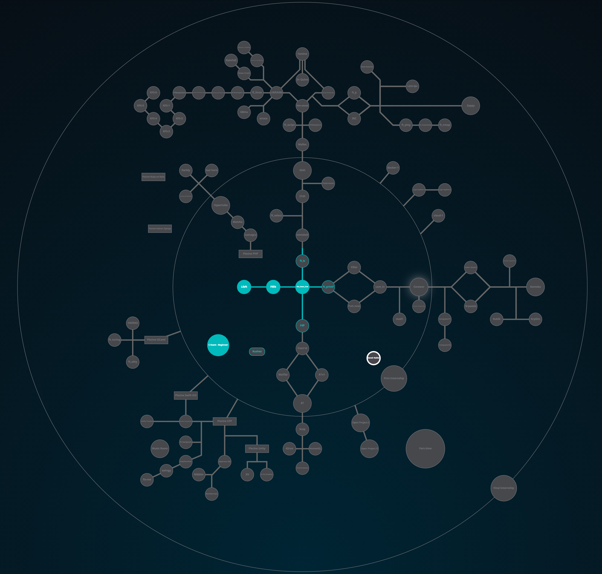

## Projects

I'll add all the projects that I've made during the 42 program.
As of now, it includes:

### List

* General
	- [libft](https://github.com/rtbalabukha/42/tree/master/Projects/Basics/Libft)
	- [fillit](https://github.com/rtbalabukha/42/tree/master/Projects/Basics/Fillit)
	- [get_next_line](https://github.com/rtbalabukha/42_get_next_line)

* Graphics
	- [fdf](https://github.com/rtbalabukha/42_FDF/)
	- [fractol](https://github.com/rtbalabukha/42_Fractol/)
	- [wolf3D](https://github.com/rtbalabukha/42_Wolf3d/)

* Algorithm
	- [ft_printf](https://github.com/rtbalabukha/42_ft_printf/)
	- [lem-in](https://github.com/rtbalabukha/42_Lem-in/)

* Group
	- [rushes](https://github.com/rtbalabukha/42_Rushes/)
	- [ft_db](https://github.com/rtbalabukha/42_ft_db/)
	- [kift](https://github.com/rtbalabukha/42_Kift/)

* Miscellaneous
	- [dashes](https://github.com/rtbalabukha/42_Dashes/)
	- [hercules](https://github.com/rtbalabukha/42_Hercules/)
	- [walking_marvin](https://github.com/rtbalabukha/42_Walking_Marvin/)

* **[!] To be Completed**

	- [mod1](https://github.com/rtbalabukha/42_Mod1/)
	- [docker-1](https://github.com/rtbalabukha/42_Docker-1/)
	- [ft_ls](https://github.com/rtbalabukha/42_ft_ls/)
	- [minishell](https://github.com/rtbalabukha/42_Minishell/)

## As a reference this is the full map displaying all the available projects

